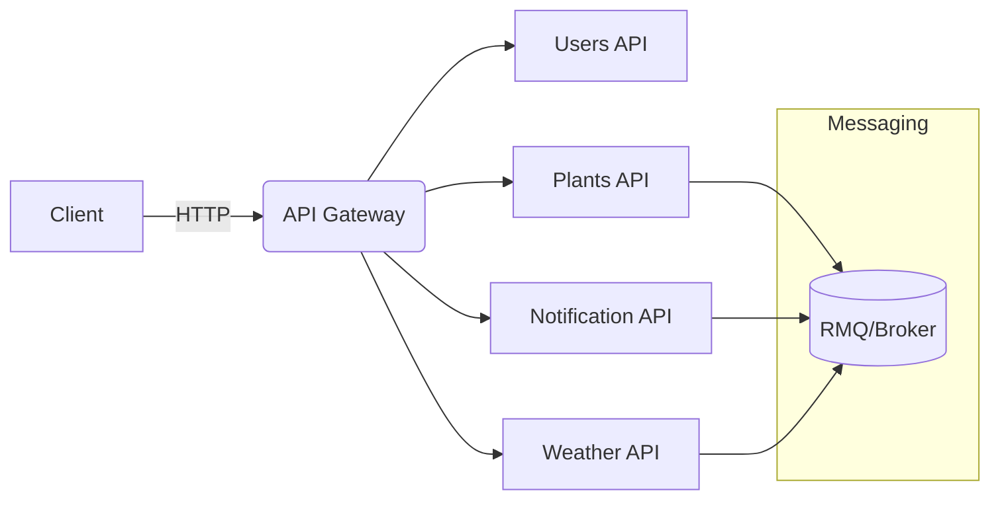
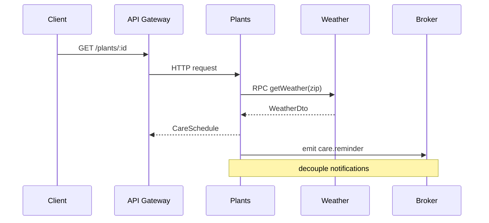

## Evolution to Microservices

### Goals
- Enable hyper-growth via modular decomposition and independent scaling
- Scale vertically (feature complexity) and horizontally (service distribution)

### Vertical Scaling (Inside Modules)
- Enrich Weather with multiple providers, circuit breaker, fallback, bulkhead isolation
- Split Users into Identity, Profile, Preferences subdomains
- Introduce Notification module (email/push/SMS) with queue
- Add PlantCare domain (scheduling, analytics)

### Horizontal Scaling (Across Services)
- Extract independent services when bounded contexts stabilize:
  - Plant Service, Weather Service, Notification Service, Identity Service, Analytics Service
- Use Nest Microservices over RMQ/Redis/NATS; API Gateway fronts BFF/HTTP

### Reference Topologies
- Monolith + Modules → Modular Monolith → Service Extraction → Federated Graph/API Gateway

### Migration Strategy
1) Strengthen boundaries in monolith (DTOs, provider contracts, events)
2) Introduce async messaging (Bull + RMQ) for background work
3) Extract first service with smallest blast radius (e.g., Weather)
4) Strangler pattern: route through API Gateway; gradually shift ownership
5) Data strategy: read replicas, CDC, per-service databases over time
6) Observability: distributed tracing, structured logs, metrics, health checks

### Diagrams

### Feature Scaling vs Service Scaling
- Feature scaling: add capabilities within a module; enforce SOLID; keep small classes
- Service scaling: split by bounded context; own data; contract-first APIs; async events

### Operational Readiness
- Standard config via ConfigService schema; secrets in vault
- Health checks (Terminus); readiness/liveness probes
- Rate limiting and quotas at gateway; per-tenant throttling
- Telemetry: OpenTelemetry traces/logs/metrics

### Risks
- Premature extraction increases complexity; favor modular monolith until hotspots are clear
- Cross-service transactions; embrace eventual consistency

### Roadmap (High-level)
- Q1: queue + notifications; add events; structured logging
- Q2: extract Weather Service; add API Gateway; start multi-tenant context propagation
- Q3: extract Notifications; introduce Analytics pipeline; add DLQ + retries
- Q4: federated Graph/API; per-service schema ownership; SLOs + autoscaling

