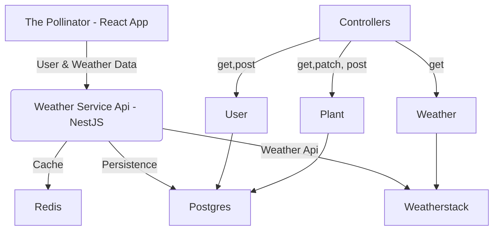

# the-pollinator-nestjs-react
The Pollinator App is designed to help guide the care of plants, making plant care easier and more predictable by integrating weather data and user inputs.

## POLLINATOR WEB APP

### React App
- The user-facing part of the app where users can check plant care schedules, add plants, and see real-time weather impacts.
- React handles the UI and sends requests to the backend for all the data needed
    - WIP

### NestJS Api
- This is the backend that powers everything. Service pulls weather data, manages user and plant info, and caches frequently accessed data for quick responses.
- It has three main controllers:
  - **User**: Manages user data (get, post requests for simple profile).
  - **Weather**: Fetches weather info via Weatherstack API (get requests) based on user zip.
  - **Plant**: Tracks plant care details (get, patch, post for plant data).

## Mermaid Diagram

